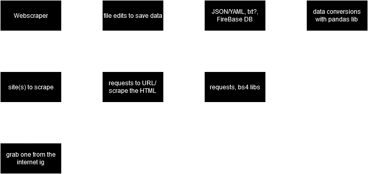

# Project log yyyaaaayyyyyyyyyyyytytykxdjhfgvlisdhf

---

## 08/01/24

- Struct Diagram - paper/digital
- Flow Chart - paper/digital

```diff
+ struct paper
- struct digital
- flow paper
- flow digital
```

## 12/01/24

- same as last lesson but without the `+struct paper`

```diff
+ struct digital
- flow paper
- flow digital
```

### proof of digital struct



## 15/01/24

- finish base data scrape
- ? flow paper
