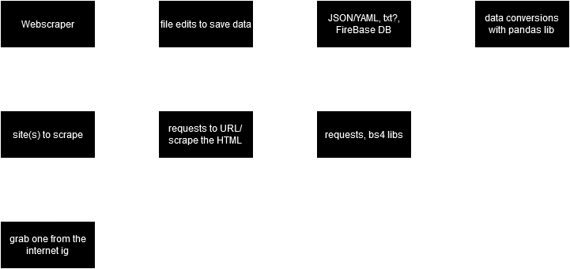

# Project log yyyaaaayyyyyyyyyyyytytykxdjhfgvlisdhf

---

## 08/01/24

- struct diagram - paper/digital
- flow chart - paper/digital

```diff
+ struct paper
- struct digital
- flow paper
- flow digital
```

## 12/01/24

- same as last lesson but without the `+struct paper`

```diff
+ struct digital
- flow paper
- flow digital
```

### proof of digital struct


( forgot auth, will add it though )

## 15/01/24

- finish base data scrape
- ? flow paper

```diff
+ { added on 22/01/24, not accurate i think }
+ base data scrape
+ { since } prints it nicely, includes time, rain, temp
- flow paperdraw
- flow digital
```

## 22/01/24

- clean code
- make `fetchWeather()` a func
- ? start `fetchNews()`

```diff
+ started auth
+ { in club } finished auth :)
+ rearranged into files
- still flow lol
- tests
```

i need to do the flow chart desperately
and tests

## 26/01/24 { not necessary }

just thought id put this here to log everything i did previously

```diff
+ 25% works
+ main.py finished ( meaning 25% chance of whatever is done )
+ i think i optimised weather.py a little
= might use a class at some point                    they're pretty cool
```

## 09/02/24 { technically not necessary }

Code is essentially finished!
Maybe a few minor touch ups needed, but I'm happy with it

```diff
+ implemented `Database` class
+ implemented JSON save for fetched data
- literally still no flow chart
- still need to make tests
- hurry up and make tests
- ive  already tested everything just didnt document it
- everything works perfectly
```

[Tests!!!!!!](./tests.md)

## 04/03/24 { i missed a few lessons worth of logging }

ill probably do the flow chart today idk
maybe
and probably in lucidchart because it looks nice or smth
